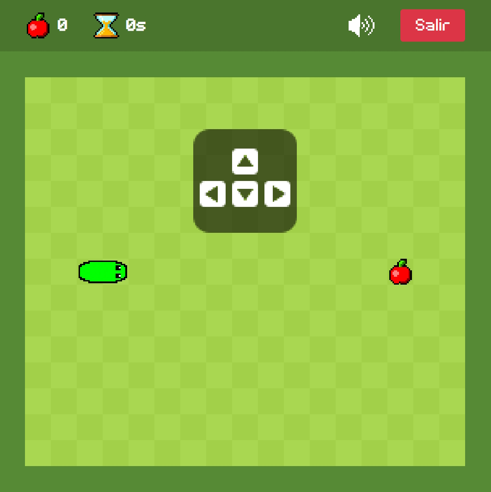
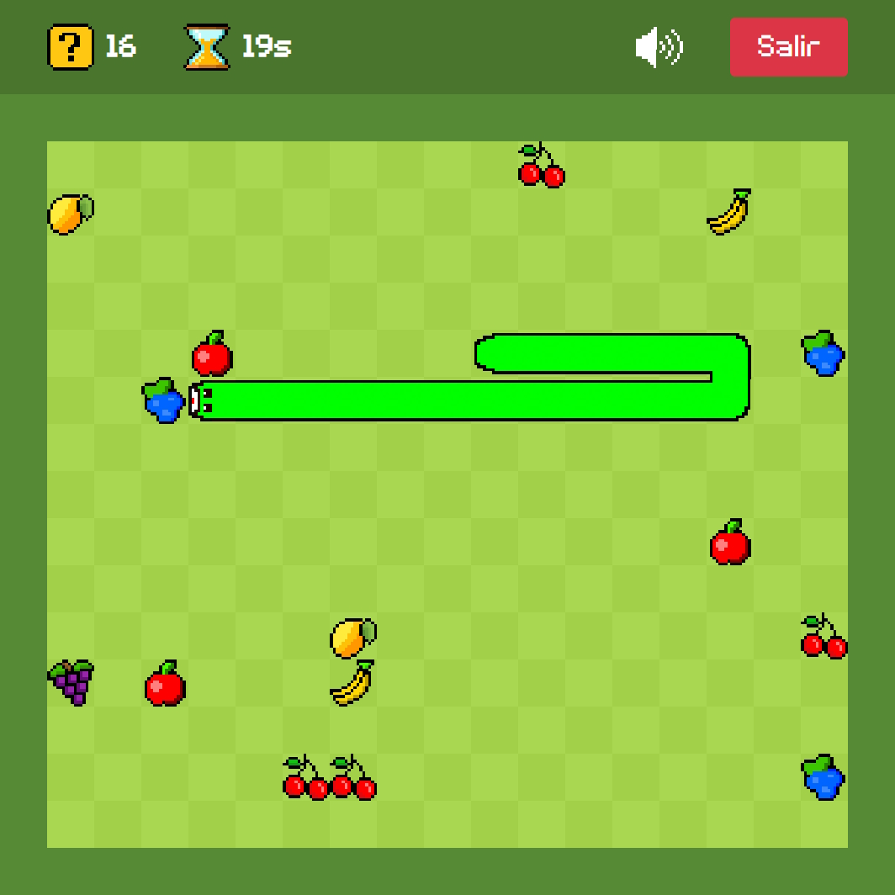
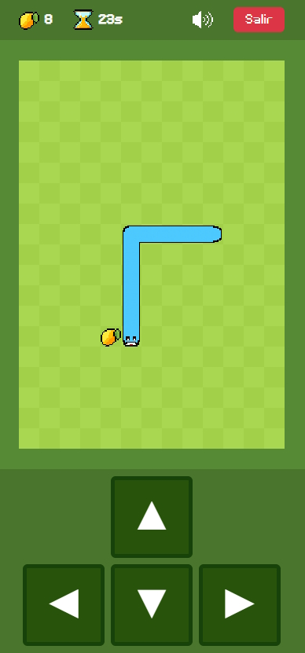

# 🐍 Snake Game with React

Welcome to the **Snake Game** project! This is a modern twist on the classic snake game, built using React JS. It's simple, fun, and has some cool customizations. You can start playing right away by clicking [here](https://eulogioqt.github.io/snake-game).

  
  

  
  

## 🚀 Features

- **Responsive Design:** Play on any device—use your keyboard on a PC or the touch controls that appear on mobile.
- **Sound Effects:** Enjoy immersive sound effects that make the game more enjoyable!
- **Multiple Food Types:** Variety is the spice of life, even for snakes!
- **Customizable Backgrounds:** Choose different styles to match your mood.
- **Custom Snake Colors:** Personalize your snake’s appearance.
- **Adjustable Food Quantity:** Set how much food appears on the board.
- **Variable Speed:** Modify the snake's movement speed.
- **Automatic Mode:** Watch the snake play by itself (no AI—just a pattern).
- **Immortal Mode:** Explore the game without the fear of dying.

**Win Condition:** To win, your snake must eat all the food, growing until it fills the entire board!

## 🧠 Math Behind the Game

While developing this game, I incorporated some interesting math concepts that I hadn’t expected to use. Although my implementations may not be optimal, they worked well and highlight the importance of math in programming.

### Hamiltonian Circuit
The "Automatic Mode" leverages a Hamiltonian circuit—a path that visits every vertex of a graph exactly once and returns to the start. In our case, the game grid represents the graph, with each cell as a vertex. However, due to a mathematical property, a true Hamiltonian cycle can't exist on a grid with both dimensions being odd. This presented a unique challenge, which you can read more about [here](https://math.stackexchange.com/questions/3644957/why-theres-no-hamiltonian-cycle-for-a-grid-where-m-and-n-are-odd).

### 2D Cross Product
To render the snake's twists correctly with textures instead of a plain color, I needed to determine the orientation of turns—whether they were clockwise or counterclockwise. This was achieved using the 2D cross product, which helps determine the relative orientation of vectors in 2D space.

### Cantor's Pairing Function
For the food system, I used Cantor’s pairing function to efficiently map a pair of coordinates to a single unique number. This allowed me to store and retrieve the sprite ID for each food item without needing extra data structures or complex logic.

---

Feel free to fork this project, suggest improvements, or report any issues. Happy coding! 🎮
